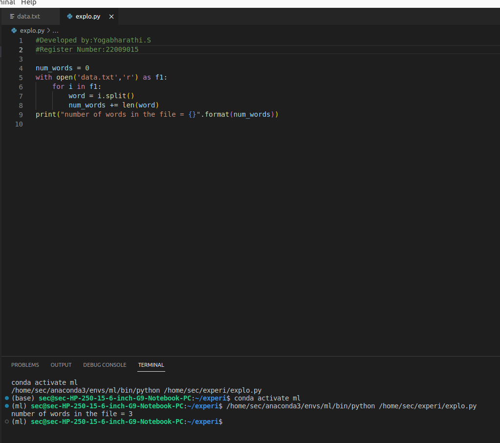

# Word-count
## AIM:
To write a python program for getting the word count from a text.
## EQUIPEMENT'S REQUIRED: 
PC
Anaconda - Python 3.7
## ALGORITHM: 
### Step 1:
Step 1:Create a txt file to count the number of word in that file.

Step 2:Open the txt file in read mode using open().

Step 3:Using split() function to split the words in the txt file and count it.

Step 4:Save the python program using .py extention.

Step 5:Run the python program in terminal to get the output.

Step 6: Number of words in the txt file is displayed as the output

## PROGRAM:
```
#Developed by:Yogabharathi.S
#Register Number:22009015

num_words = 0 
with open('data.txt'.'r') as f1: 
    for i in f1:
    word = i.split() 
    num_words += len(word)
print("number of words in the file = {}".format(num_words))
```
### OUTPUT:


## RESULT:
Thus the program is written to find the word count from a text.
